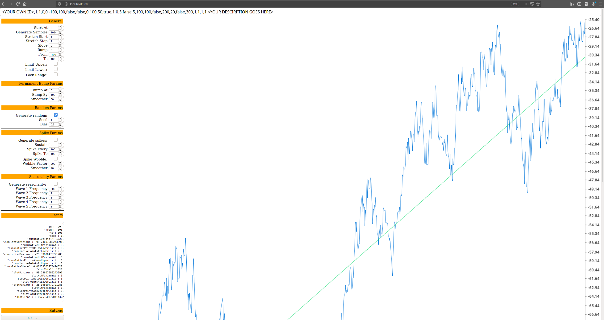

# TGEN

Fake ***T***ime series data ***GEN***erator tool written in Go.

Linux 64 bit binary is [here](tgen.linux.amd64.gz).

Windows 64 bit binary is [here](tgen.windows.amd64.exe.gz).

Or you can clone and use `go build` with your desired architecture. TGEN was
built with `go version go1.13.3 linux/amd64`.

## Background

I worked on a project where we needed to design a large time series data
warehouse whose input systems were unrelieable and many edge cases identified.
I even put together an article on the cases if you're interested
[here](https://www.linkedin.com/pulse/what-gotchas-edge-cases-when-processing-raw-time-series-dragan-rajak/).

The requirements for a fake timeseries generator were:

 * Generate data as a realtime stream or a batch input file

 * Generate plain text CSV or JSON in any format

 * Generate gigabytes of data for stress and volume testing

 * Generate millions of unique identities (see
   [here](https://www.linkedin.com/pulse/what-time-series-data-do-we-really-collect-dragan-rajak/)
   for background on terminology)

 * Generate consistent, repeatable data to facilitate testing

 * Simulate missing samples and missing data (two different concepts outlined
   below)

 * Generate seasonality, spikes, outliers and errors

I couldn't find what I wanted so as anyone would do I just put together
something quick and took it as an opportunity to learn a bit of Go.

This tool implements all of the above requirements and uses the
[go-fake-ts](https://github.com/powerpu/go-fake-ts) library which generates the
underlying numbers.

## Concepts

*You can have a read through the [go-fake-ts
library](https://github.com/powerpu/go-fake-ts) readme or the [Golang
documentation](https://godoc.org/github.com/powerpu/go-fake-ts) documentation
for some underlying concepts of the libary. They're summarised here for
convenience.*

The package breaks down time series data into two major parts, samples and the
actual data.

There is a distinctinction between "bad samples" and "bad data". 

An example of the distinction would be in an example of collecting CPU and
memory data from a server.

In a "valid sample" the collection server would connect and retrieve this
information from the destination server in a particular way with no issues.

In a "bad sample" scenario, the destination server would be running fine but
due to a network outage a sample would not be collected.

In a "bad data" scenario, the destination server would be running and the
network would be up but due to a rogue process the CPU value would not be able
to be collected while memory could. The end result is that the CPU data is
"bad".


## Basics

There are 4 types of objects one can create in the config. They are:

 * **Random** - A true/false pattern that changes randomly (e.g. 5% true)

 * **Pattern** - A true/false pattern that repeats (e.g. 2 true, 1 false)

 * **Time** - Time one would plot on the X-axis of a time series graph (e.g.
   steady 30 minute intervals)

 * **Data** - Actual numbers one would plot as a feature/metric in a timeseries
   graph (e.g. 0 to 100, going up)

The general usage would be to instantiate define the types in the config file,
design the relevant output data template and run the tool to generate the data.
Refer to "Workflow" below for more info.

Ultimately the goal is to generate time series data that may look as follows:

```
  Timestamp, CPU, Memory
  1581039550,23.5,97.2
  1581039650,26.5,84.9
  ...etc...
```

One would use the true/false value of a Pattern or Random to determine what to
print.

An example simulation scenario could be generating data where every 24th hourly
sample fails because you want to simulate a scheduled job taking up too many
resources and thus not retrieving data.

For this you would use a 23 good samples and 1 bad samples pattern with time
going up by 1 hour intervals. 


## Workflow

The fundamental workflow of how you would use the tool is as follows:

 1. Identify the sorts of *numerical* use cases you would like to generate.
    Examples include "I need numbers between 0 and 100 that trend upwards" or
    "I need numbers to follow seasonality every 500 points" or "I need numbers
    between 50 and 100 that trend upwars but spike to 110 every 100 samples for
    3 samples".

 1. Identify the sorts of *times* you would like to generate. Examples include
    "Perfect hourly, 1:00:00, 2:00:00 etc..." or "Half hourly but with a
    potential delay of up to 10 seconds, 1:00:03, 2:00:09 etc...".

 1. Identify the sorts of *missing sample patterns* you would like to see.
    Examples include "No missing samples", "Regularly, 12 valid samples
    followed by 3 bad ones", "Randomly, about 15% need to be bad samples".

 1. Use the `./tgen playarea` command to start a webserver and connect to it to
    visualise the different configuration parameters for your fake data.

 1. Put the parameters the playarea command generates into the config file (you
    can get defaults if you run `./tgen default` to start you off).

 1. Familarise yourself a little with Golang
    [templates](https://golang.org/pkg/text/template/) and use them to generate
    data generation templates that fit your needs be they CSV, JSON or
    something else entirely.

 1. Use the tool to generate the fake data using `./tgen generate`.


## Example Scenario

Let's say we want to create the following scenario:

 * Collect data from 3 rain sensors

 * Collection frequency is 1 hour

 * Sensor 1 is always perfect

 * Sensor 2 is uncontactable (i.e. bad) 15% of the time

 * Sensor 3 is always contactable but due to a bug cannot provide every 8th
   sample

What you would do in this scenario is create the following in your config:

 * A `random` that will give us `true` 85% of the time (100% good - 15% bad = 85% good). This will be used for sensor 2.

 * A `pattern` that will give us `true` 7 times and `false` 1 time. This will be used for Sensor 3.

 * A `time` that will increment perfectly by 1 hour. This will be used for all Sensors.

 * 3 different types of `data` to represent each sensors conditions/values.

The config may look like this:

```
RANDOM
ID,SEED,GOOD_PCT,DESCRIPTION
r1,1,0.85,80% good
PATTERN
ID,PATTERN_GOOD,PATTERN_BAD,DESCRIPTION
p1,7,1,7 good 1 bad
TIMES
ID,INCREMENT,VARIANCE,DIRECTION,DESCRIPTION
t1,3600000,0,0,1 hour time no variance
DATA
ID,STRETCH_START,STRETCH_END,SLOPE,BUMP,FROM,TO,LIMIT_UPPER,LIMIT_LOWER,PERMA_BUMP_AT,PERMA_BUMP_BY,PERMA_BUMP_SMOOTHER,USE_RANDOM,RANDOM_SEED,RANDOM_BIAS,GENERATE_SPIKES,SPIKE_SUSTAIN,SPIKE_EVERY,SPIKE_TO,SPIKE_WOBBLE,SPIKE_WOBBLE_FACTOR,SPIKE_SMOOTHER,USE_SEASONALITY,SEASONALITY_WAVE1,SEASONALITY_WAVE2,SEASONALITY_WAVE3,SEASONALITY_WAVE4,SEASONALITY_WAVE5,DESCRIPTION
d1,1,1,0,0,50,100,false,false,0,0,0,true,1,0.5,false,5,100,100,false,200,20,false,300,1,1,1,1,Random example
d2,1,1,0,0,10,100,false,false,43,100,1,true,1,0.5,false,5,100,100,false,200,20,false,300,1,1,1,1,Random example with a permanent bump
d3,1,1,0,0,30,100,false,false,0,0,0,false,1,0.5,false,5,100,100,false,200,20,true,300,1,1,1,1,Seasonality example
```

Parameters are explained in the "Help for 'Generate'" below and in the 
[NewData function Godoc](https://godoc.org/github.com/powerpu/go-fake-ts#NewData) 
documentation of the [go-fake-ts](https://github.com/powerpu/go-fake-ts) library.

You would also normally use `./tgen playarea` to help you generate the desired
config for `DATA` since it can accept many parameters.

Let's say you want to generate a simple CSV that may look like this:

```
SensorName,Timestamp,  mmPerHour
Sensor-1,  1580000000, 23.5
Sensor-2,  1580000000, 6.5
Sensor-3,  1580000000, 0.1
Sensor-1,  1580003600, 23.5
Sensor-2,  1580003600, 6.5
Sensor-3,  1580003600, <missing>
Sensor-1,  1580007200, 23.5
Sensor-3,  1580007200, 0.1
...etc...
```

Notice how `Sensor-3` has "bad data" at `1580003600` while `Sensor-2` has a
"bad sample" `1580007200` (i.e. it's actually missing).

Your Golang template for this example would look like this:

```
Sensor-1,{{ $.t1.Val.Unix }},{{ $.d1.Val }}
{{- if $.r1.Val }}
Sensor-2,{{ $.t1.Val.Unix }},{{ $.d2.Val }}
{{- end }}
Sensor-3,{{ $.t1.Val.Unix }},{{ if $.p1.Val }}{{ $.d3.Val }}{{ else }}<missing>{{ end }}
```

You would then run `./tgen generate -c example.conf -t example.template` and
would see the following:

```
Sensor-1,1582258623,-74.37104824258068
Sensor-3,1582258623,66.3612572924182
Sensor-1,1582262223,-74.41366470389394
Sensor-2,1582262223,-54.57002078285556
Sensor-3,1582262223,67.72191749239796
Sensor-1,1582265823,-74.40755940656285
Sensor-2,1582265823,-54.56554356481276
Sensor-3,1582265823,69.08138376940538
Sensor-1,1582269423,-74.39862143076873
Sensor-2,1582269423,-54.558989049230405
Sensor-3,1582269423,70.4390598166005
Sensor-1,1582273023,-74.45354889738809
Sensor-2,1582273023,-54.59926919141793
Sensor-3,1582273023,71.79435011239748
Sensor-1,1582276623,-74.15663251792097
Sensor-2,1582276623,-54.381530513142046
Sensor-3,1582276623,73.14666018167978
Sensor-1,1582280223,-73.97096610806699
Sensor-2,1582280223,-54.245375145915794
Sensor-3,1582280223,<missing>
Sensor-1,1582283823,-73.71534051521435
Sensor-2,1582283823,-54.05791637782386
Sensor-3,1582283823,75.83996853654665
Sensor-1,1582287423,-73.6529642565065
Sensor-2,1582287423,-54.012173788104754
Sensor-3,1582287423,77.1797854480721
Sensor-1,1582291023,-73.6533284540953
Sensor-2,1582291023,-54.01244086633656
Sensor-3,1582291023,78.51425990315435
```

This generates 10 samples by default, which is 30 lines since the template
represents one sample (actually 29 in our example since one sample is missing).

There are many other options you can pass. Refer to "Help for 'Generate'" below
for more parameters you could pass.

For example if you want to generate a continuous stream of numbers with a 1
second delay you would run the following:

```
./tgen generate -c example.conf -t example.template -s -r 1000
```

## Embedded Documentation

The tool also has documentation embedded in itself and is shown below.

### No arguments
```
[tgen]$ ./tgen

(T)ime series data (Gen)erator is a flexible fake time series data
generator built with love by me, myself and I in Go. Complete documentation is
available at https://github.com/powerpu/tgen

Usage:
  tgen [flags]
  tgen [command]

Available Commands:
  default     Prints out the default internal config and template
  generate    Generates fake time series data
  help        Help about any command
  playarea    Starts a webserver playarea to quickly visualise generated data

Flags:
  -h, --help   help for tgen

Use "tgen [command] --help" for more information about a command.
```


### Help for "default"

```
[tgen]$ ./tgen help default
Prints out the default internal config and template you can use as a starting
point for developing your own fake data.

Usage:
  tgen default [flags]

Flags:
  -h, --help   help for default
```


### The "default" templates

```
[tgen]$ ./tgen default

Printing the default config:
===========================

RANDOM
ID,SEED,GOOD_PCT,DESCRIPTION
r0,1,0,All bad
r1,1,0.1,10% good
r2,1,0.2,20% good
r3,1,0.3,30% good
r4,1,0.4,40% good
r5,1,0.5,50% good
r6,1,0.6,60% good
r7,1,0.7,70% good
r8,1,0.8,80% good
r9,1,0.9,90% good
r10,1,1,All good
PATTERN
ID,PATTERN_GOOD,PATTERN_BAD,DESCRIPTION
p0,0,1,All bad
p1,1,1,1 good 1 bad
p2,2,1,2 good 1 bad
p3,3,1,3 good 1 bad
p4,3,2,3 good 2 bad
p5,5,2,5 good 2 bad
p6,24,24,24 good 24 bad
p7,144,144,144 good 144 bad
p8,7,1,7 good 1 bad
p9,14,2,14 good 2 bad
p10,1,0,All good
TIMES
ID,INCREMENT,VARIANCE,DIRECTION,DESCRIPTION
t0,300000,0,0,5 minute time no variance
t1,300000,5000,0,5 minute time 5s variance
t2,300000,30000,0,5 minute time 30s variance
t3,300000,100000,0,5 minute time 1m variance
t3p,300000,0,0,5 minute time no variance
t3e,300000,100000,0,5 minute time 1m either way variance
t3a,300000,100000,1,5 minute time 1m always positive variance
t3b,300000,100000,-1,5 minute time 1m always negative variance
t4,3600000,0,0,1 hour time no variance
t5,3600000,60000,0,1 hour time 1m variance
t6,3600000,300000,0,1 hour time 5m variance
t7,3600000,600000,0,1 hour time 10m variance
t8,86400000,0,0,1 day time no variance
t9,86400000,3600000,0,1 day time 1h variance
t10,86400000,18000000,0,1 day time 5h variance
t11,86400000,36000000,0,1 day time 10h variance
DATA
ID,STRETCH_START,STRETCH_END,SLOPE,BUMP,FROM,TO,LIMIT_UPPER,LIMIT_LOWER,PERMA_BUMP_AT,PERMA_BUMP_BY,PERMA_BUMP_SMOOTHER,USE_RANDOM,RANDOM_SEED,RANDOM_BIAS,GENERATE_SPIKES,SPIKE_SUSTAIN,SPIKE_EVERY,SPIKE_TO,SPIKE_WOBBLE,SPIKE_WOBBLE_FACTOR,SPIKE_SMOOTHER,USE_SEASONALITY,SEASONALITY_WAVE1,SEASONALITY_WAVE2,SEASONALITY_WAVE3,SEASONALITY_WAVE4,SEASONALITY_WAVE5,DESCRIPTION
d0,1,1,0,0,-100,100,false,false,0,0,0,true,1,0.5,false,5,100,100,false,200,20,false,300,1,1,1,1,Random example
d1,1,1,0,0,-100,100,false,false,43,100,1,true,1,0.5,false,5,100,100,false,200,20,false,300,1,1,1,1,Random example with a permanent bump
d2,1,1,0,0,-100,100,false,false,0,0,0,false,1,0.5,false,5,100,100,false,200,20,true,300,1,1,1,1,Seasonality example
d3,1,1,0,0,-100,100,false,false,0,0,0,true,1,0.5,true,5,200,100,false,200,20,false,300,1,1,1,1,Random example with a spike
d4,1,1,0,100,-100,100,false,false,0,0,0,true,1,0.5,true,5,200,-100,false,200,20,false,300,1,1,1,1,Random example with a negative spike
d5,1,100,0,0,-100,100,false,false,0,0,0,false,1,0.5,false,5,100,100,false,200,20,true,300,1,1,1,1,Seasonality example with a stretch
d6,100,1,0,0,-100,100,false,false,0,0,0,false,1,0.5,false,5,100,100,false,200,20,true,300,1,1,1,1,Seasonality example with a squish


Printing the default template:
===========================

example,uuid={{ uuid }} [r5 random]({{ if $.r5.Val }}TRUE{{ else }}FALSE{{ end }}) [p2 Pattern]({{ $.p2.Val }}) [d0 Value]({{$.d0.Val}}) [d1 Value]({{$.d1.Val}}) [d2 Value]({{$.d2.Val}}) [d3 Value]({{$.d3.Val}}) [t3b Time Epoch]({{$.t3b.Val.Unix}})  [t3b Time]({{$.t3b.Val}})
```


### Help for "Generate"

```
[tgen]$ ./tgen help generate
Generates fake time series data based on configuration and templates

Usage:
  tgen generate [flags]

Flags:
  -c, --config string           Which config file to use?
                                
                                You can generate a sample config and templates using the 'config' command.
                                
                                The config file is a simple CSV file in the following format:
                                
                                RANDOM
                                [RANDOM HEADER]
                                {RANDOM ENTRIES}
                                PATTERN
                                [PATTERN HEADER]
                                {PATTERN ENTRIES}
                                TIMES
                                [TIMES HEADER]
                                {TIMES ENTRIES}
                                DATA
                                [DATA HEADER]
                                {DATA ENTRIES}
                                
                                Where:
                                
                                 'RANDOM' indicates a the literal word RANDOM on its own line indicating that 
                                         the lines that follow are loading random entries.
                                
                                 'PATTERN' indicates a the literal word TIMES on its own line indicating that 
                                         the lines that follow are loading pattern entries.
                                
                                 'TIMES' indicates a the literal word TIMES on its own line indicating that the
                                         lines that follow are loading time entries.
                                
                                 'DATA'  indicates a the literal word DATA on its own line indicating that the
                                         lines that follow are loading data entries.
                                
                                
                                RANDOM
                                ======
                                
                                An example RANDOM entry may look like the following:
                                
                                 r3,1,0.3,30% good
                                
                                For 'RANDOM' the header/columns are as follows:
                                
                                 ID
                                    An id for this entry so that you can refer to it in the template like this
                                    '$.r0.Val'
                                
                                 SEED
                                    A seed to use for any random numbers used internally
                                
                                 GOOD_PCT
                                    A percentage of samples that will return 'true'
                                
                                 DESCRIPTION
                                    Optional description to help the user
                                
                                
                                PATTERN
                                =======
                                
                                An example PATTERN entry may look like the following:
                                
                                 p2,2,1,2 good 1 bad
                                
                                For 'PATTERN' the header/columns are as follows:
                                
                                 ID
                                    An id for this entry so that you can refer to it in the template like this
                                    '$.p0.Val'
                                
                                 PATTERN_GOOD
                                    Starting at 0, how many good samples to generate
                                
                                 PATTERN_BAD
                                    After the good samples, how many "bad" sampled to generate.  For example if
                                    you want every third sample to be "bad" you would set PATTERN_GOOD to 2 and
                                    PATTERN_BAD to 1. You can then use it in the template like this
                                
                                          '{{- if $.p0.Val -}}'
                                
                                    to determine whether this is a 'true' value.
                                
                                 DESCRIPTION
                                    Optional description to help the user
                                
                                
                                TIMES
                                =====
                                
                                An example TIME entry may look like the following:
                                
                                 t3e,300000,100000,0,5 minute time 1m either way variance
                                
                                For 'TIMES' the header/columns are as follows:
                                
                                 ID
                                    An id for this entry so that you can refer to it in the template like this
                                    '$.t3e.Val'
                                
                                 INCREMENT
                                    Increment (in milliseconds) for the next entry
                                
                                 VARIANCE
                                	When the next value is calculated, you can use a variance to add/subtract
                                	up to the amount of milliseconds to that time. If you want perfect times
                                	set this to 0.
                                
                                 DIRECTION
                                	When the next value is calculated, you can use a value less than 0 to
                                	indicate the variance will always subtract from the intended time, a value
                                	of 0 to either subtract or add at a 50% chance or a value above 0 to always
                                	add to the intended time.
                                
                                	In other words if time is 12:00:00PM, variance is 5 seconds and direction
                                	-1 this could yield 11:59:57, but never more than 12:00:00PM. Similarly, if
                                	direction is 1 it could yield 12:00:03 but never less than 12:00:00PM. And
                                	finally, if direction is 0 then either case is equally probable.
                                
                                 DESCRIPTION
                                    Optional description to help the user
                                
                                DATA
                                ====
                                
                                An example DATA entry may look like the following:
                                
                                 d2,1,1,0,0,-100,100,false,false,43,100,1,true,1,0.5,false,5,100,100,false,200,20,false,300,1,1,1,1,0 to 100 soft lmit upward slope likely to breach max
                                
                                For 'DATA' the header/columns are as follows:
                                
                                 ID
                                    An id for this entry so that you can refer to it in the template like this
                                    '$.d2.Val'
                                
                                 STRETCH_START
                                 STRETCH_END
                                	When a default graph is generated this value "stretches" or "squishes" the
                                	data up and down. For example if the generated data has a minimum of 35 and
                                	a maximum of 60, "stretching" it will increase the difference between the
                                	minumum and maximum while "squishing" will decrease it.
                                
                                	A value above 1 will stretch, a value below 1 but more than 0 will "squish"
                                	while a value of 1 will be "normal". 
                                
                                	STRETCH_START and STRETCH_END values indicates the start and stop values.
                                	This is useful if you want to "amplify over time" or "dampen over time".
                                
                                	For example if STRETCH_START is 100, STRETCH_END is 0 and we want 100
                                	samples then we will gradually reduce the stretch from 100 to 0 over 100
                                	linear steps (i.e. the stretch value at the 50th sample will be 50).
                                
                                 SLOPE
                                	This will set the slope of the generated data. 0 means whatever the
                                	underlying data is. Positive values means data will trend upwards, negative
                                	values mean data will trend downward.
                                
                                 BUMP
                                	Tweaking this number will "bump" the random value up (or down if negative).
                                	For example if a maximum is 60, a positive "bump" will increase this value,
                                	a negative "bump" will decrease it. This is useful if you want to ensure
                                	values breach min/max in certain cases.
                                
                                 FROM
                                    Generate data "from" this number. E.g. CPU values may be from 0 to 100.
                                
                                 TO
                                    Generate data "to" this number. E.g. CPU values may be from 0 to 100.
                                
                                 LIMIT_UPPER
                                    If numbers go above "to", when this is "TRUE" values will be set to the
                                    "to" value. E.g. a CPU cannot go above 100%.
                                
                                 LIMIT_LOWER
                                    If numbers go below "from", when this is "TRUE" values will be set to the
                                    "from" value. E.g. a CPU cannot go below 0%.
                                
                                 PERMA_BUMP_AT
                                	Generate data "from" this number. E.g. CPU values may be from 0 to 100. Use
                                	0 to disable permanent bump.
                                
                                 PERMA_BUMP_BY
                                	What value should we bump to, expressed as a percentage of "to". Can be
                                	negative too.
                                
                                 PERMA_BUMP_SMOOTHER
                                	When smoother is 1 we will go straight from current value to bump value.
                                	When smoother is above 1 when we will take this number of samples to reach
                                	the bump value (i.e. gradually but quickly rise to a spike). Use 0 to
                                	disable permanent bump.
                                
                                 USE_RANDOM
                                    Whether to generate random numbers. When "TRUE" numbers will be generated
                                    based on the below parameters.
                                
                                 RANDOM_SEED
                                    A seed to use for any random numbers used internally
                                
                                 RANDOM_BIAS
                                    A parameter between 0 and 1. Use it to control the range and slope of your
                                    data. Generally lower biases make the slope negative but which values
                                	entirely depend on the underlying dataset. As always, have a play to
                                    see the effects.
                                
                                 GENERATE_SPIKES
                                    Whether to generate spikes. When "TRUE" spikes will be generated based on
                                    the below parameters.
                                
                                 SPIKE_SUSTAIN
                                    When a spike is reached, for how many samples should we sustain it.
                                
                                 SPIKE_EVERY
                                    Starting at 0, every n samples will reach the desired spike value.
                                
                                 SPIKE_TO
                                    What value should we spike to, expressed as a percentage of "to".
                                
                                 SPIKE_WOBBLE
                                    When we're spiking and sustaining it, do we use a flat value at the top or
                                    do we "bounce off the top" a little for a little variation? When "TRUE" it
                                	means that when sustaining we'll add a little variance. We respect and will
                                	never break the SPIKE_TO value though!
                                
                                 SPIKE_WOBBLE_FACTOR
                                    A magic number to tweak the "wobbliness". Have a play with this value.
                                	Generally a higher value will mean smoother values.
                                
                                 SPIKE_SMOOTHER
                                    When smoother is 0 we will go straight from current value to spike value.
                                    When smoother is above 0 when we will take this number of samples to reach
                                    the spike value (i.e. gradually but quickly rise to a spike)
                                
                                 USE_SEASONALITY
                                    Whether to generate seasonality using SIN. When "TRUE" waves will be
                                    generated using the WAVE parameters below.
                                
                                 SEASONALITY_WAVE[1-5]
                                    Indicates number of points where one SIN cycle will be complete.  Each wave
                                    is summed to generate interference.
                                
                                 DESCRIPTION
                                    Optional, but highly desirable, description to help the user.
                                
                                You can use the 'playarea' command to play with the values and generate the
                                corresponding DATA entries.
                                
                                Any row starting with a '#' will be treated as a comment.
  -f, --fromTime string         Date and/or time to use as a starting point for *all* time generation.
                                Uses Go date format, see https://golang.org/pkg/time/#Parse. (default "now()")
  -d, --fromTimeFormat string   Date format to use for the 'from' parameter.
                                The default format is the output of the 'date' command. (default "Mon Jan 2 15:04:05 MST 2006")
  -z, --fromTimeZone string     Timezone to use.
                                See https://en.wikipedia.org/wiki/List_of_tz_database_time_zones.
  -h, --help                    help for generate
  -j, --jitter int              What "jitter" to add to the rate in milliseconds.
                                At random a number between 0 and value submitted will be added or subtracted at
                                random for a variance in rate of output. For example, if rate is 100 and jitter
                                is 20 actual rate will be between 80 and 120.
  -o, --offset int              Generates data from a particular starting point. Used for continuing runs.
  -p, --out string              Print to file. Use '-' for STDOUT. (default "-")
  -r, --rate int                What delay in milliseconds to use between each sample.
                                This is useful if you need to run this continuously but slowly as opposed to
                                one large dump.
  -n, --samples int             Number of samples to generate. (default 10)
  -m, --stats int               Print the stats of the data in
                                the input config not the numbers. This is useful if you want to get a feel
                                for what the data will look like.
  -s, --stream                  Continuously generate data.
  -t, --template string         Template to use.
                                Uses the Go template language (See https://golang.org/pkg/text/template/)
```

### Help for "Playarea"

```
[tgen]$ ./tgen help playarea
Starts a webserver which you can use to tweak parameters and see the effect
they have on the random data that will be generated by the 'generate' command

Usage:
  tgen playarea [flags]

Flags:
  -h, --help       help for playarea
  -p, --port int   Port to use for playarea server. (default 8080)
```

Once you open your browser you will be greeted with a page that looks like this:



A word of warning though, the page has been awarded "best webpage design" in
the 1997 international web design awards.
